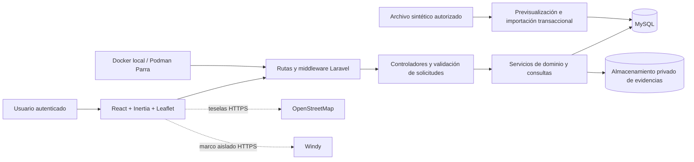
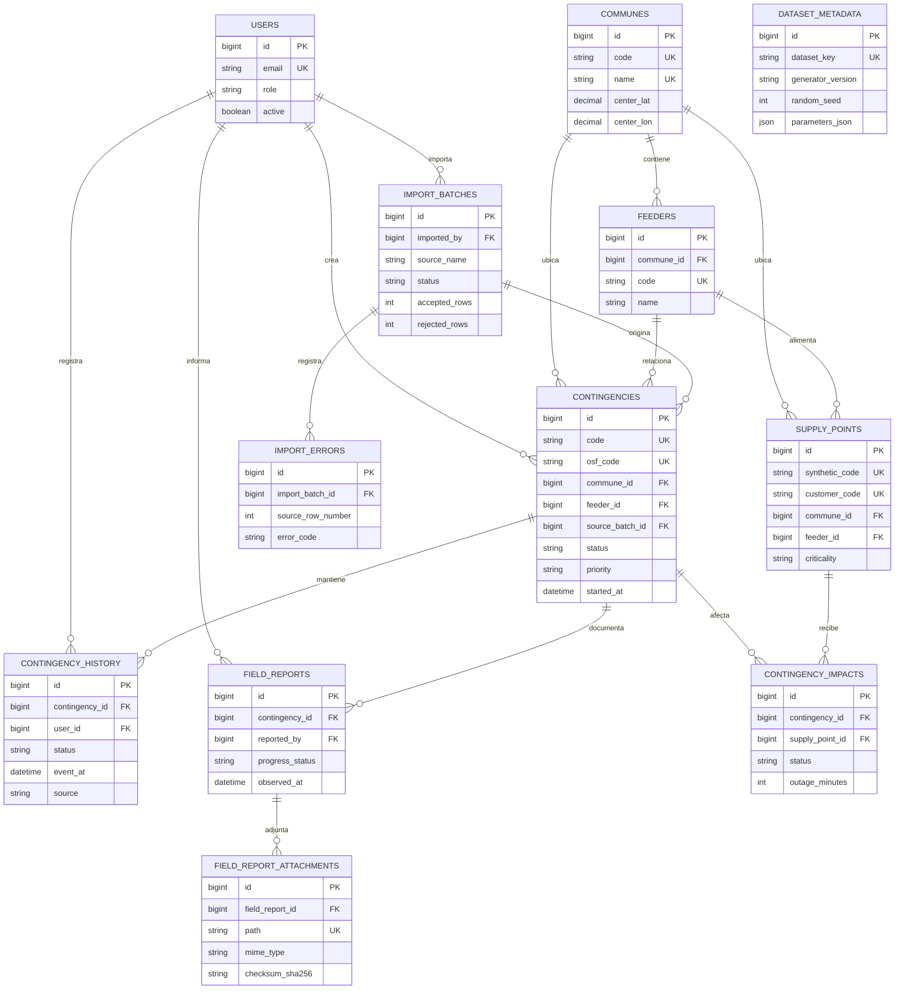

# Arquitectura y modelo de información vigentes

Este documento representa la solución implementada al cierre local del
Segmento 13. Complementa el diseño conceptual del anteproyecto con las
decisiones necesarias para seguridad, trazabilidad, importación y despliegue.

## Vista de componentes

La aplicación conserva un único backend Laravel. La interfaz no decide los
permisos: autenticación, roles, estados y acceso a información protegida se
validan nuevamente en el servidor. MySQL se ejecuta como servicio separado y
no forma parte de la imagen de aplicación.

## Correspondencia con los servicios del anteproyecto

| Servicio esperado | Componente vigente |
|---|---|
| Acceso y usuarios | Autenticación Laravel, sesiones en base de datos, rol y cuenta activa |
| Gestión de contingencias | Controladores de detalle y estado, reglas de transición y transacciones |
| Consulta y filtros | Consultas paginadas, filtros comunes y rangos calendario |
| Dashboard | Agregaciones operativas, evolución y distribución comunal |
| Georreferenciación | Leaflet, consulta por área visible y agrupación de marcadores |
| Reportes de terreno | Antecedentes, georreferencia opcional y archivos privados |
| Informes | Consulta consolidada y exportaciones CSV/PDF en tres modalidades |
| Importación | Previsualización, validación, lotes, errores y persistencia atómica |

## Modelo entidad-relación implementado

`DATASET_METADATA` identifica el conjunto sintético y no necesita una relación
operacional con las demás tablas. Las tablas internas de sesiones, caché y
trabajos de Laravel se omiten del diagrama porque no forman parte del dominio.

## Evolución respecto del modelo conceptual

- El punto de suministro contiene códigos sintéticos de cliente y suministro;
  no existe una entidad con datos personales reales en el prototipo.
- La falla se representa mediante la contingencia, su causa, estado e impactos,
  evitando una duplicación sin uso funcional.
- La bitácora histórica, los antecedentes de terreno y sus evidencias se
  modelan explícitamente para satisfacer trazabilidad.
- Los lotes y errores de importación conservan el origen y permiten auditar
  aceptaciones y rechazos.
- Los conteos críticos y electrodependientes se exponen de forma agregada; los
  perfiles sin autorización no acceden a identificadores protegidos.

## Escalabilidad prevista

1. Las fuentes futuras PowerOn o CIOP deben ingresar mediante adaptadores que
   traduzcan sus formatos al modelo validado, sin acoplar controladores a una
   fuente particular.
2. La base MySQL separada permite cambiar host, respaldo y capacidad sin
   reconstruir la imagen de aplicación.
3. El mapa consulta solo el área visible y agrupa puntos cercanos para evitar
   enviar todo el universo al navegador.
4. Las exportaciones PDF pueden migrarse a una cola de trabajos si aumenta su
   concurrencia; las consultas ordinarias ya se validan con 30 sesiones.
5. OpenStreetMap y Windy permanecen aislados: su indisponibilidad degrada solo
   la cartografía base o el pronóstico, no el registro almacenado en MySQL.
