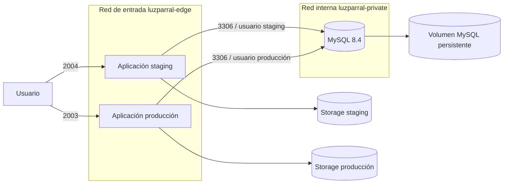

# Decisiones de arquitectura para el despliegue institucional

## Contexto y alcance

SIGCEL debe ejecutarse en la cuenta institucional de Parra mediante Podman
rootless, publicar staging en el puerto `2004` y reservar `2003` para la versión
estable. La base institucional inicialmente considerada no es utilizable para
este proyecto. La solución mantiene el alcance de prototipo académico: usa
datos sintéticos o autorizados, no controla la red eléctrica y no incorpora
servicios distribuidos innecesarios.

## Interesados y preocupaciones

| Interesado | Preocupación arquitectónica |
| --- | --- |
| Usuarios de Luzparral | Disponibilidad y consistencia de consultas, mapas e informes |
| Administración del sistema | Despliegue repetible, respaldo, recuperación y control de acceso |
| Universidad | Uso acotado de recursos, puertos asignados y ejecución rootless |
| Equipo de proyecto | Mantenibilidad, evidencia verificable y futura migración empresarial |

## Requisitos arquitectónicamente significativos

| ASR | Escenario medible | Decisión y evidencia |
| --- | --- | --- |
| ASR-01 Disponibilidad | Tras iniciar la sesión del usuario del servidor, los contenedores deben permanecer activos y `/up` debe responder correctamente. | `--restart unless-stopped`, `Linger=yes`, `verify.sh` y prueba posterior a reinicio. |
| ASR-02 Confidencialidad | Un escaneo de puertos del host no debe encontrar MySQL en `3306`. | Red Podman `--internal`; MySQL no utiliza `--publish`; `database.sh status` lo comprueba. |
| ASR-03 Aislamiento | Staging y producción no deben compartir esquema ni credencial de aplicación. | Bases y usuarios diferentes dentro de una sola instancia MySQL; plantillas separadas. |
| ASR-04 Recuperabilidad | Antes de una migración debe existir un `mysqldump` consistente con SHA-256 y metadatos. | `backup-database.sh`; `deploy.sh` cancela si el respaldo falla. |
| ASR-05 Restauración segura | Una restauración no debe sobrescribir una base con tablas ni ejecutarse mientras la aplicación escribe. | `restore-database.sh` exige checksum, metadatos, destino vacío y aplicación detenida. |
| ASR-06 Modificabilidad | Una versión candidata debe probarse sin reemplazar la estable. | Staging `2004`, producción `2003`, volúmenes y configuraciones separados. |
| ASR-07 Trazabilidad | Cada paquete debe asociarse a imagen, commit, plataforma y suma SHA-256. | `EXPORTAR_IMAGEN.ps1` genera artefactos y metadatos para aplicación y MySQL. |

## ADR-01: aplicación monolítica y MySQL en el mismo servidor

**Decisión.** Mantener el monolito Laravel/React y ejecutar MySQL Community 8.4
como un contenedor separado en Parra.

**Motivo.** El sistema tiene un único dominio funcional y una carga académica
acotada. Separar procesos permite persistencia y recuperación independientes
sin introducir la complejidad operativa de microservicios.

**Consecuencia.** El servidor es un punto único de falla. Esta limitación es
aceptable para el prototipo universitario y debe reevaluarse antes de un uso
empresarial productivo.

## ADR-02: una instancia MySQL, dos bases y dos usuarios

**Decisión.** Compartir el motor MySQL para reducir memoria, pero aislar
`sigcel_staging` y `sigcel_production` mediante credenciales diferentes.

**Motivo.** Dos motores aumentarían el consumo sin aportar alta disponibilidad.
La separación lógica evita que la aplicación de staging acceda a producción.

**Consecuencia.** Una falla del motor afecta ambos entornos. Los respaldos se
generan por base y la promoción no copia automáticamente datos de staging.

## ADR-03: MySQL sin exposición pública

**Decisión.** Conectar aplicación y base mediante `luzparral-private`, creada
con `podman network create --internal`, sin mapear `3306` al host. Las
aplicaciones se conectan además a `luzparral-edge` para publicar `2004/2003`;
MySQL nunca se une a esa red de entrada.

**Motivo.** Solo Laravel necesita conectarse a MySQL. La administración se
realiza por SSH y `podman exec`, reduciendo superficie de ataque.

**Consecuencia.** No se podrá conectar un cliente MySQL remoto directamente.
Si fuese imprescindible, debe utilizarse un túnel SSH autorizado, no la apertura
permanente del puerto.

## ADR-04: respaldo previo y reversión diferenciada

**Decisión.** Crear un respaldo consistente antes de migrar y conservar la
reversión automática de la imagen de aplicación.

**Motivo.** Volver a una imagen anterior no revierte cambios de esquema. Por
ello se distinguen dos recuperaciones: rollback de contenedor y restauración de
base.

**Consecuencia.** Una migración destructiva requiere ventana de mantenimiento,
revisión previa y una restauración ensayada. El script nunca restaura de forma
automática sobre una base con tablas.

## Vistas de despliegue

El puerto `3306` existe únicamente dentro de la red privada de contenedores.
Los únicos puertos publicados por este diseño son `2004` y `2003`.

## Límites y evolución posterior

- HTTPS, monitoreo externo, copias fuera del servidor y alta disponibilidad
  requieren coordinación institucional o empresarial.
- Producción no se habilita hasta aprobar staging con el protocolo definido.
- Una futura migración a infraestructura empresarial puede sustituir el motor
  local por MySQL administrado conservando las variables `DB_*` y el contrato de
  respaldo, sin rediseñar los módulos funcionales.
